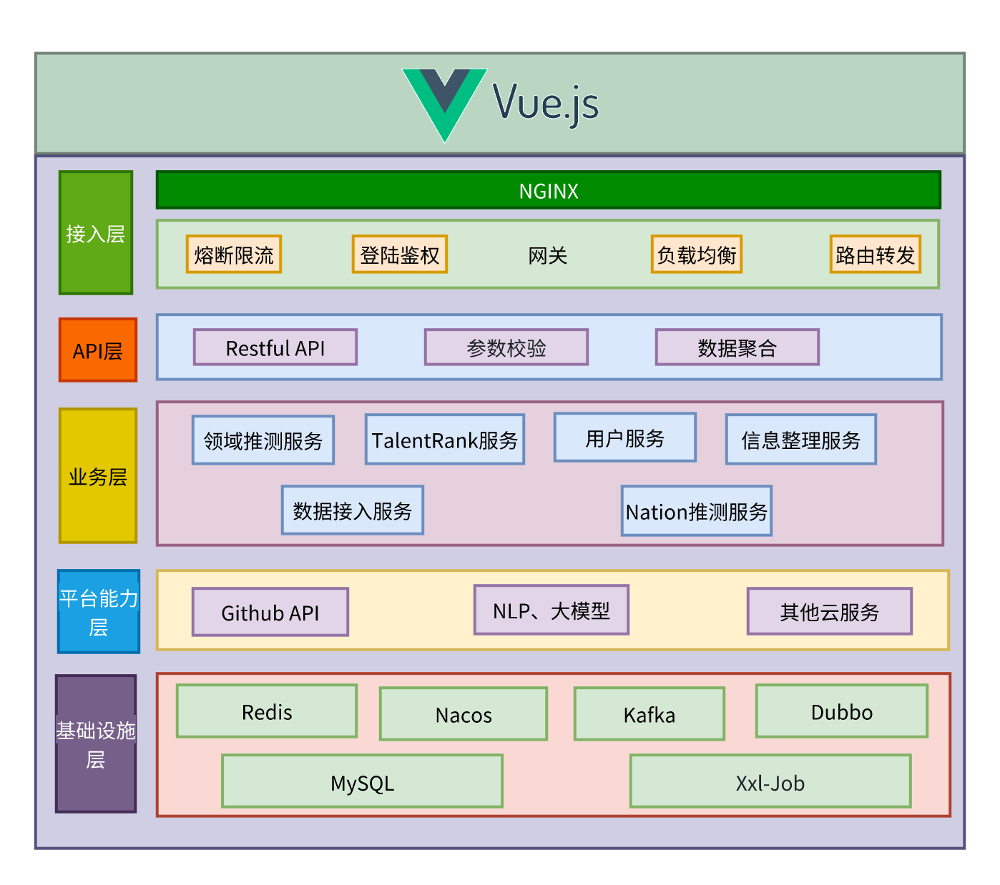
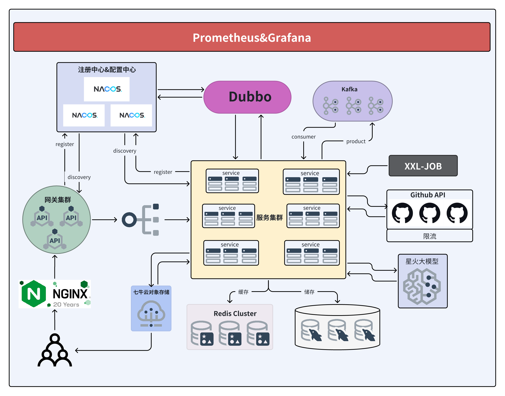

# 一、项目演示

视频演示：

公网访问地址：

# 二、项目介绍

**Gitgle是一个基于Github开源数据驱动的开发者评估应用**。

**Gitgle**实现了对开发者技术能力的评估，并将它使用TalentRank(TR)表示。

**Gitgle**实现了对未知location的开发者进行 Nation 推测，并通过置信度过滤。

**Gitgle**实现了对开发者领域的推测，精确推测开发者的多个领域，并通过置信度过滤。

用户可以在网站进行注册和登陆以及对用户个人信息的管理。

用户可以查看自己的Github相关信息，包括粉丝数、仓库数等，同时可以查看自己的TR,领域以及Nation。

用户可以在网站上看到Github开发者的技术能力排行榜、热门仓库排行榜、热门领域以及Github的相关数据统计。

用户可以在网站上通过领域、国家、用户名等条件对开发者进行搜索，搜索结果同样根据TR排行。

网站还为用户提供了热门领域，用户可以查看热门领域以及热门领域内的开发者排行。

用户可以查看排行榜上所有开发者的详细信息，包括TR、Nation、领域以及它们的粉丝、仓库等数据。

# 三、项目运行

## 前端

1. ### 克隆项目


```Bash
git clone https://github.com/LL1105/front.git
```

2. ### 安装包管理工具NPM

   安装 npm 主要是通过安装 Node.js 来实现

   ####   下载 Node.js 安装包

    1. 打开浏览器，访问 [Node.js 官方网站](https://nodejs.org/)。

    2. 在网站首页，会看到有两个版本的下载链接，分别是 LTS（长期支持版）和 Current（最新版）。对于大多数用户来说，推荐下载 LTS 版本，它更加稳定可靠。点击适合你 Windows 系统的 LTS 版本的下载链接，一般为 64 位的.msi 安装文件。


   ####   运行安装程序
    
   1. 找到下载好的 Node.js.msi 安装文件，双击运行它。
        
   2. 在安装向导中，点击 “Next” 按钮，接受许可协议，选择安装目录等。一般情况下，可以使用默认的设置直接点击 “Next” 按钮进行下一步操作。
        
   3. 在安装过程中，会自动安装 npm 以及其他相关的组件。等待安装完成。
        
    
      
    
   ####   验证安装
    
   1. 安装完成后，按下 `Win + R` 键，打开 “运行” 对话框，输入 `cmd` 并回车，打开命令提示符窗口。
        
   2. 在命令提示符中，分别输入以下命令来验证 Node.js 和 npm 的安装情况：
        
        1. `node -v`：此命令用于查看 Node.js 的版本号，如果安装成功，会显示类似 `v18.17.1` 的版本信息。
            
        2. `npm -v`：该命令用于查看 npm 的版本号，如显示 `9.6.7` 等版本信息，则说明 npm 也安装成功。


3. ### 启动项目


```Bash
cd Gitgle
npm run serve
```

## 后端

1. ### 克隆项目
    

```Bash
git clone https://github.com/LL1105/backend.git
```

2. ### 安装运行环境
    

#### 2.1 安装JDK

##### 2.1.1 打开浏览器，访问[Oracle官网](https://www.oracle.com/jp/java/technologies/downloads/)，找到JDK8版本，选择和电脑匹配的操作系统的jdk版本(Linux/Windows/Macos)进行下载。

##### 2.1.2双击jdk安装文件，根据向导依次点击下一步即可安装完毕。

#### 2.2 安装maven

##### 2.2.1 打开浏览器，访问[Maven官网](https://maven.apache.org/download.cgi)，下载Maven的压缩包文件。

##### 2.2.2 解压下载的压缩包到指定的文件夹。

3. ### 编译项目
    

```Bash
cd backend
mvn clean install
```

4. ### 按顺序启动各个模块
    

```Bash
java -jar data-service/data-service-server/target/data-service.jar
java -jar talentrank-service/talentrank-service-server/target/talentrank-service.jar
java -jar nation-service/nation-service-server/target/nation-service.jar
java -jar user-service/user-service-server/target/user-service.jar
java -jar domain-service/domain-service-server/target/domain-service.jar
java -jar api-service/target/api-service.jar
java -jar gateway-service/target/gateway-service.jar
```

# 四、项目架构

Gitgle总体使用前后端分离架构，旨在通过前后端解藕实现并行开发，提升开发效率。

前端使用Vue框架，后端使用Spring boot以及Dubbo进行微服务开发。使用Nginx承载前端流量并代理请求，使用Springcloud Gateway作微服务网关进行统一鉴权，熔断限流，路由转发，负载均衡等，使用Nacos做注册配置中心，使用Dubbo作Rpc框架，使用Redis作分布式缓存，MySQL持久化存储，Kafka做消息队列，使用Xxl-Job实现分布式任务调度，并使用Prometheus和Grafana实现对服务运行状态的可视化监控报警。





# 五、项目分工

|     |                                                     |
| --- | --------------------------------------------------- |
| 毛军军 | 架构设计、基础设施建设、TalentRank计算模块、Nation推测模块、领域推测模块、Github数据系统开发 |
| 廖鑫  | 网关鉴权，用户服务，信息整理服务，数据聚合                               |
| 张昊阳 | 前端页面架构设计、用户界面设计、交互逻辑实现、组件化开发、前端与后端交互                |
